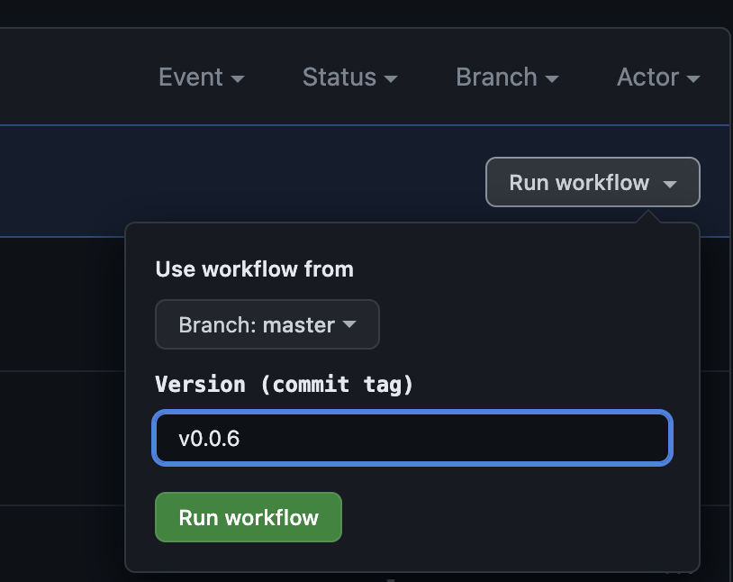

# Git Flow

The idea is to have one long-lived branch "master".
On push to that branch, the code is deployed to the staging environment.

The production should be deployed on release publish.

[Excalidraw diagram](https://link.excalidraw.com/l/1vrQ6FyH9mj/9vKB70dRiT5)

## Standard flow

The developer creates a short-lived branch from master, introduces some changes and
then creates a pull request to master.
For pr to be merged, the code should be reviewed and tested.

Possible jobs:

- unit tests
- e2e tests
- linting (eslint, stylelint, tsc --noEmit)

This code is deployed to staging.
When the code is ready to be deployed to production, the developer creates a release and tags the commit that should be
deployed to production.

## Ooops, we need a hotfix

Imagine that we have a bug in production. We need to fix it asap.
Meanwhile, the new feature is just being merged to master and not tested properly yet.

The developer should create a branch with a hotfix (`hotfix/<name>`) from the latest **_release tag_**.
After that, in case the hotfix ready and the new feature is still not tested,
the engineer should publish a release on a hotfix branch.

After that, the commit with the hotfix should be merged to master.

## Major feature development

During the development we can have a situation when the feature requires a lot of time to be developed. Moreover, it
should be validated by stakeholders and properly tested. So, we need to have a separate short-lived environment for that
feature.

In this flow we have a convention that all branches with a `major/` prefix are temporary environments for major
features.
So, the developer should create a branch with a major feature (`major/<name>`) from master.
For every push in that branch the changes are automatically deployed to the temporary environment.
When the feature is ready, the developer should create a pull request to master.
After the pr is merged, the `major/<name>` branch should be deleted, which triggers the deletion of the temp
environment.

## Rollback to the previous release

In case we need to roll back to the previous release, we should manually trigger a prod deployment workflow
with the previous release tag.

## Secrets and variables

- `WORKLOAD_IDENTITY_PROVIDER` - GCP workload identity provider should be stored in secrets. [Article](https://cloud.google.com/blog/products/identity-security/enabling-keyless-authentication-from-github-actions)
- `SERVICE_ACCOUNT` - GCP service account should be stored in secrets
- `GCP_PROJECT_ID` - GCP project id should be stored in variables `${{ vars.GCP_PROJECT_ID }}` otherwise GitHub actions
  will mask the temporary environment URL

